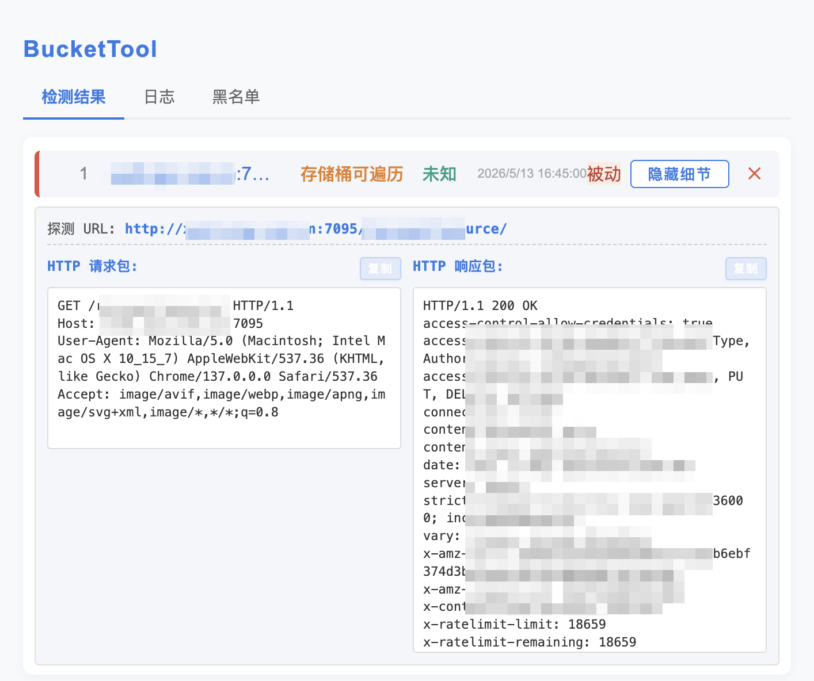
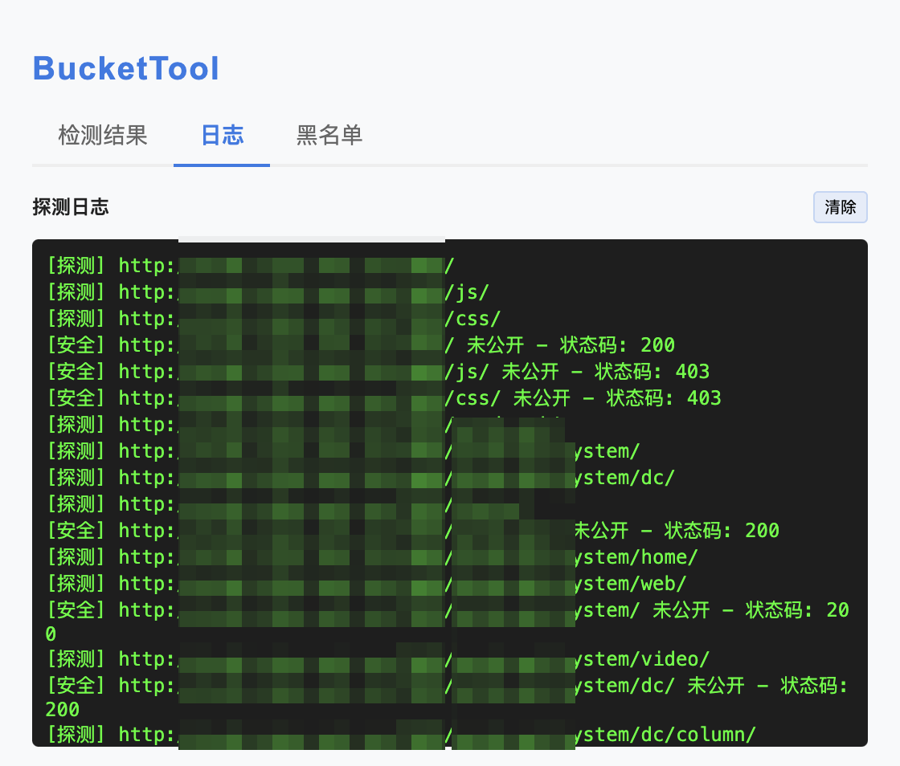
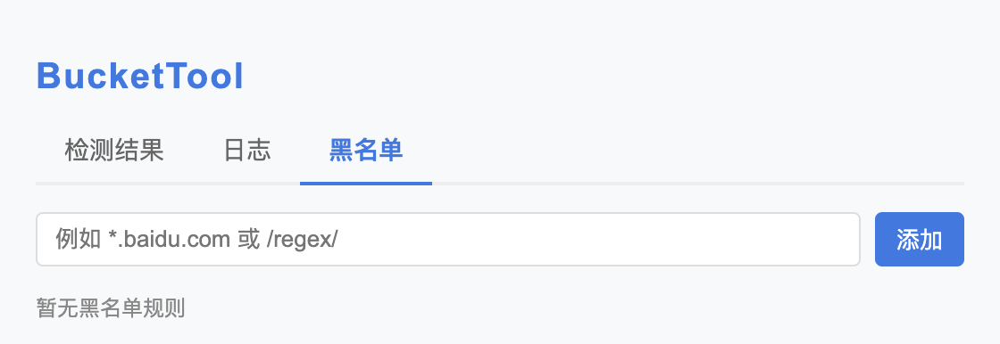

# BucketTool_2

## 项目简介

本项目基于[libaibaia/BucketTool: 浏览器存储桶配置漏洞检测插件 (github.com)](https://github.com/libaibaia/BucketTool)项目二开，新增检测多个云厂商，小小的改了一些功能，目前只测试了遍历存储桶漏洞，因为测试目标有限，其余统统都还没经过测试，所以非常容易出现非预期错误。

BucketTool _2是一款浏览器扩展，用于检测主流云存储桶（如阿里云OSS、腾讯云COS、华为云OBS、AWS S3）常见的安全漏洞，包括遍历、未授权上传、ACL/Policy配置、桶接管等。

## 主要功能
- **多模式检测**：支持主动（手动输入 URL）与被动（自动捕获网页请求）双重检测模式。
- **全厂商覆盖**：支持阿里云、腾讯云、华为云、AWS S3、百度云、七牛云、京东云、UCloud、金山云、青云、天翼云、移动云、GCS、Azure、OCI 及通用 S3 兼容存储。
- **智能速率控制**：内置自适应串行队列，根据响应时间动态调整探测间隔，避免触发目标风控。
- **专业详情展示**：点击历史条目即可查看完整的 HTTP 请求/响应报文，支持一键复制，方便漏洞复现与报告编写。
- **黑名单过滤**：支持通配符（如 `*.baidu.com`）和正则表达式，精准屏蔽无需检测的域名。
- **实时日志与通知**：探测过程实时记录，发现漏洞时图标红点提醒，数据持久化保存不丢失。

## 支持的云厂商
- 阿里云 OSS
- 腾讯云 COS
- 华为云 OBS
- AWS S3（含中国区）
- 百度智能云 BOS
- 七牛云 Kodo
- 京东云 OSS
- UCloud UFile
- 金山云 KS3
- 青云 QingStor
- 天翼云 OOS
- 移动云 EOS
- Google Cloud Storage (GCS)
- Azure Blob Storage
- Oracle OCI Object Storage
- 通用 S3 兼容存储（如 MinIO, Ceph 等）

## 使用方法
1. **安装扩展**：
   - 在 Chrome/Edge 浏览器扩展管理页面（chrome://extensions/）开启开发者模式，加载本项目目录。
2. **主动检测**：
   - 点击扩展图标，打开日志窗口，选择厂商，输入存储桶URL，点击“开始检测”。
   - 检测过程和结果会实时显示在日志窗口。
3. **被动检测**：
   - 浏览器访问页面时自动检测 URL 中的云存储桶，发现漏洞会在历史中记录并红点提醒。

## 主要界面说明
插件 Popup 采用三选项卡设计：

1. **检测结果**：
   
   - 以列表形式展示所有发现的漏洞。
   - 点击“展示细节”可展开查看完整的 HTTP 请求包与响应包，并支持一键复制。
   - 
   
2. **探测日志**：
   
   - 实时滚动显示后台探测进度（探测中、发现、安全、错误）。
   
   - 支持一键清除本地日志缓存。
   
     
   
3. **黑名单管理**：
   - 支持添加域名或 URL 到黑名单，支持 `*` 通配符匹配。
   
   - 被加入黑名单的域名将不再触发任何探测行为。
   
     

## 注意事项
- 仅检测公开可访问的存储桶，无法检测需鉴权的私有桶。
- 检测请求为匿名访问，不会携带用户凭证。
- 检测结果仅供安全测试与自查，禁止用于非法用途。
